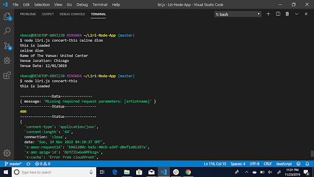
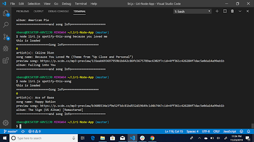
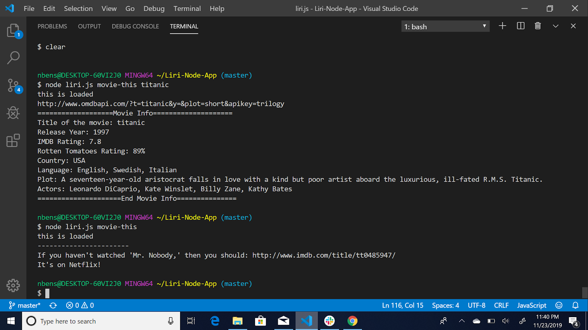
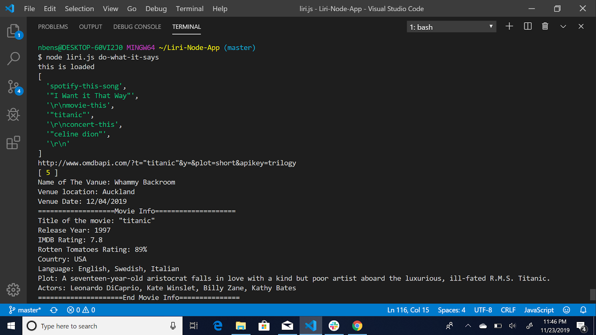
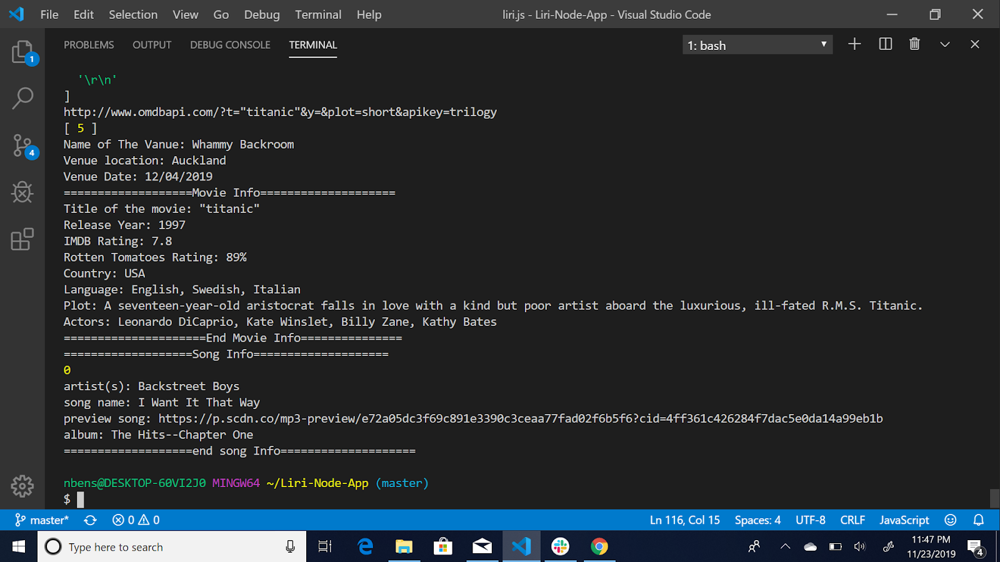

# Liri-Node-App

<<<<<<< HEAD
=======
LIRI is like iPhone's SIRI. However, while SIRI is a Speech Interpretation and Recognition Interface, LIRI is a Language Interpretation and Recognition Interface. LIRI will be a command line node app that takes in parameters and gives you back data.

This app can take in one of the following commands:

1- concert-this and should show:

 -name of the venue
 - Venue Location
 - date f the Venue
  

2- spotify-this-song and should show:

Artist(s)
The song's name
A preview link of the song from Spotify
The album that the song is from

If no song is provided then your program will default to "The Sign" by Ace of Base.

3 - movie-this and should show:

- Title of the movie.
- Year the movie came out.
- IMDB Rating of the movie.
- Rotten Tomatoes Rating of the movie.
- Country where the movie was produced.
- Language of the movie.
- Plot of the movie.
- Actors in the movie.

If the user doesn't type a movie in, the program will output data for the movie 'Mr. Nobody.'

4 - do-what-it-says:
   Using the fs Node package, LIRI will take the text inside of random.txt and then use it to call IRI's commands.
   

